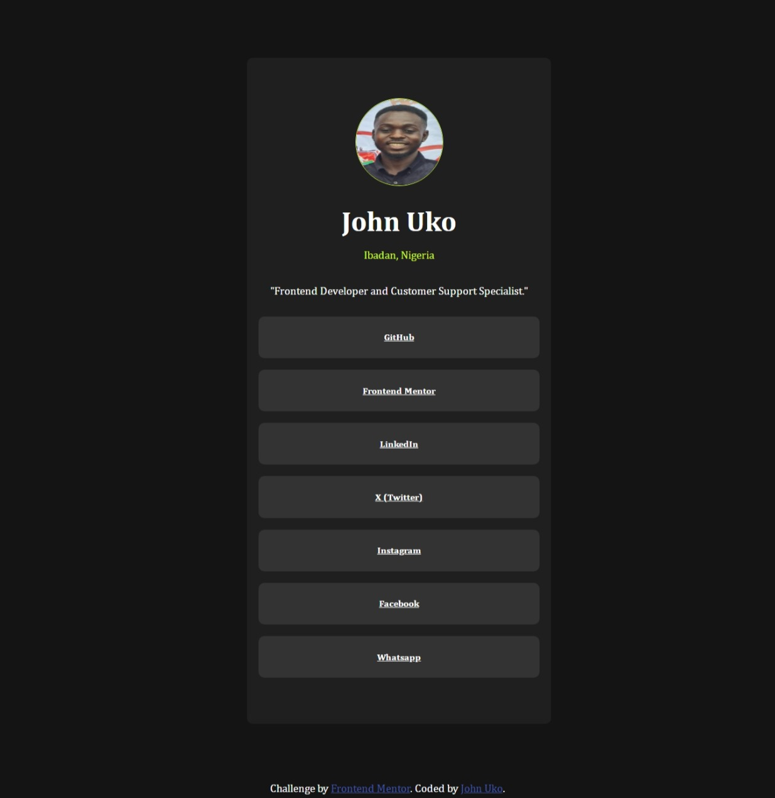

# Frontend Mentor - Social links profile solution

A clean, modern, responsive social link profile built using HTML & CSS.
This project is inspired by a Frontend Mentor challenge and focuses on creating responsive social link profile using CSS Flexbox, and mobile-first responsive design.

## Table of contents

  - The challenge
  - Screenshot
  - Links
  - Built with
  - What I learned
  - Continued development
  - Useful resources
  - Author

### The challenge

Users would be able to:

- See hover and focus states for all interactive elements on the page
- Conveniently navigate through the page on different screen sizes
- Follow through each link and visit each social media profile
- Each link clicked open on a new separate tab without overriding the current tab

### Screenshot



### Links

- Solution URL: https://github.com/John-Uko/Social-media-Portfolio.git
- Live Site URL: https://mysocialmediaportfolio.netlify.app/

### Built with

- Semantic HTML5 markup
- CSS custom properties
- Flexbox
- Mobile-first workflow


### What I learned
```css
@media screen and (max-width:){
  mobile responsiveness with mobile first approach.
}

### Continued development
I will learn more on mobile responsiveness for different breakpoint and improve on my css property-value units usage

## Author

- John Uko

- GitHub: https://github.com/John-Uko

- Frontend Mentor: https://www.frontendmentor.io/profile/John-Uko

